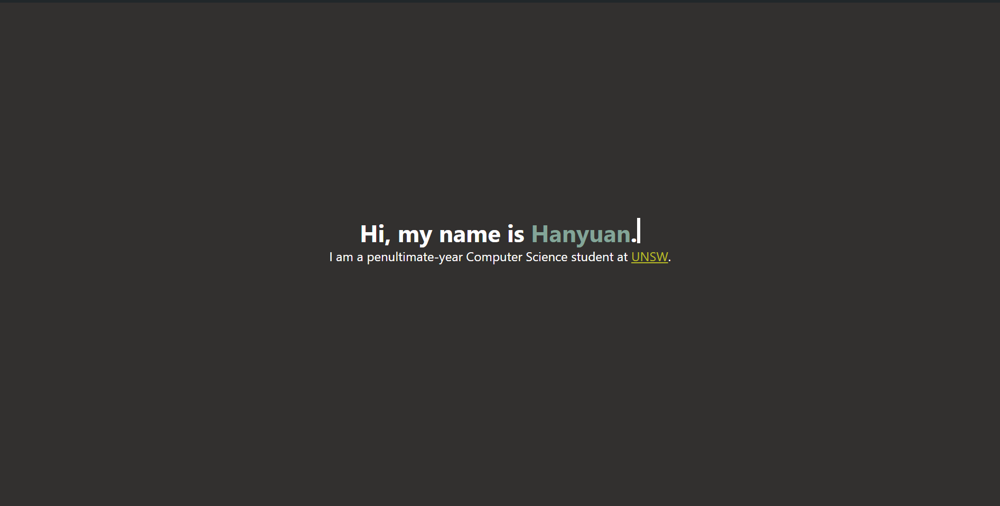

# `hanyuone.live`

> [!note]
> A lot of the architecture of this app was taken from [this excellent blog post](https://blakerain.com/blog/ssg-and-hydration-with-yew)
> and [the corresponding GitHub repo](https://github.com/BlakeRain/blakerain.com).
> Without Blake's existing work I literally do not think I would be able to get
> this far, and I've honestly learned a lot from reading through the repo, would
> highly recommend if you're interested in Rust webdev :D

My personal website (mostly containing blog posts) written in Rust. Currently WIP,
but I am slowly working on it!

## Architecture

The project is fairly straightforward, only using Yew since we want to deploy
on GitHub Pages (which requires the app to not have a server). However, there
are some aspects of the app which deserve attention:
- There are three crates in this application - two binaries (`csr` and `ssr`)
  and a library.
- Headers that need to be overwritten (e.g. titles) are wrapped in `<Head>` in
  each page - this component injects those headers into the actual `<head>` in
  a specific spot in `index.html`.
- `pulldown_cmark` is used to parse Markdown files (used for blogs) and to
  then translate them to `VNode`s that can be used by Yew.

## Installation

Make sure you have the following installed:
- Rust (confirmed to work on `v1.74.1`)
- `cargo-watch` (for local MD development)
- `trunk` (for building Rust files into WebAssembly)
- `node` and `pnpm` (for building Tailwind, running commands)

To run the local version (client-side rendering), run `pnpm dev`, which will run
the following processes in the background:
- `cargo watch` for any blog/MD rendering changes
- `trunk serve` for the website itself

To build static HTML/CSS/JS/WASM files, run `pnpm build`.
