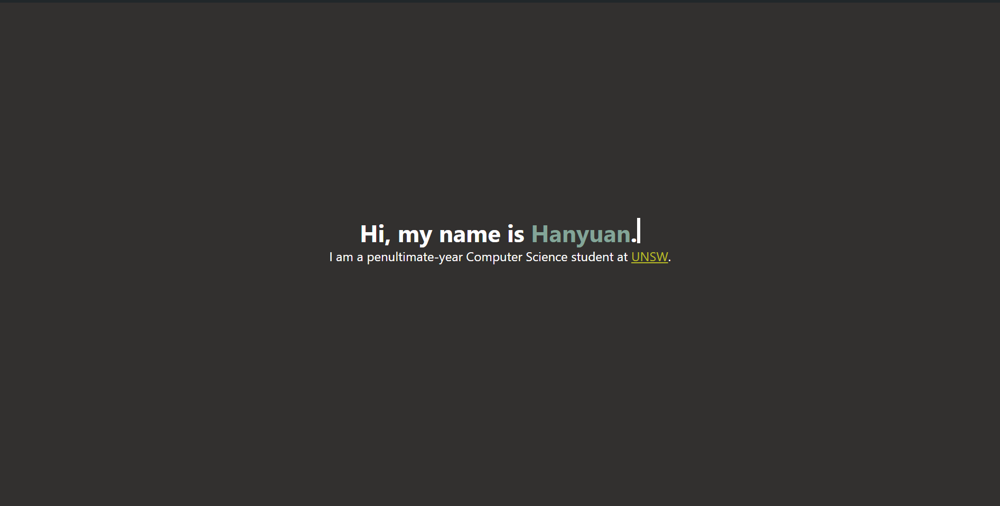

# `hanyuone.live`

My personal website written in Rust. Currently WIP!

## Architecture

This project contains:

- `website` - a static site generator that uses `leptos`
- `markdown` and `macros` - a Markdown parser for blogs that uses `pulldown_cmark`, and helper macros

The website itself does not require a server, so all files are statically generated and rendered
using GitHub Pages.

## Installation & running

Make sure you have the following installed:
- Rust (currently using `v1.94.1`)
- [`cargo-leptos`](https://github.com/leptos-rs/cargo-leptos)
- Node.js (currently using `v22.18.0`)
- [`pnpm`](https://pnpm.io) (currently using `v9.6.0`)

To test the website locally, run `pnpm dev`. This calls `cargo leptos watch` in the background,
which listens for file changes and builds static files on change. A minimal Axum server is then
run to serve those files.

To only build static HTML/CSS/JS/WASM files, run `pnpm build`.

## Licensing

- The blogs are licensed under CC BY-SA v4.0.
- `macros` and `markdown` are licensed under the 3-Clause BSD license.
- Everything else is licensed under GPL v3.0.

See [`licenses`](licenses) for the licenses themselves.

## Learning resources

This website was originally built using `yew`, and followed instructions from
[this excellent blog post](https://blakerain.com/blog/ssg-and-hydration-with-yew).
The `macros` and `markdown` crates are based off of [`blakerain.com`'s source code](github.com/BlakeRain/blakerain.com/tree/5494e204b44f0eaa46b7703f19222eb75b1bf533),
back when it was still written in Rust.

